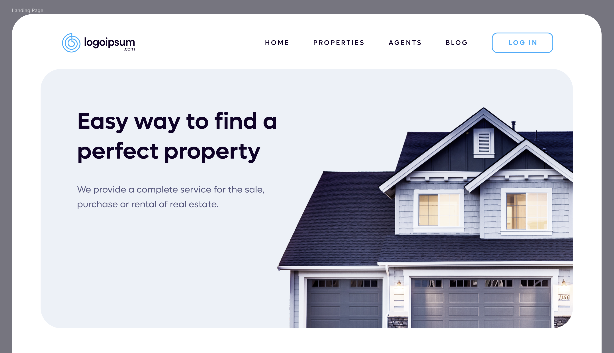
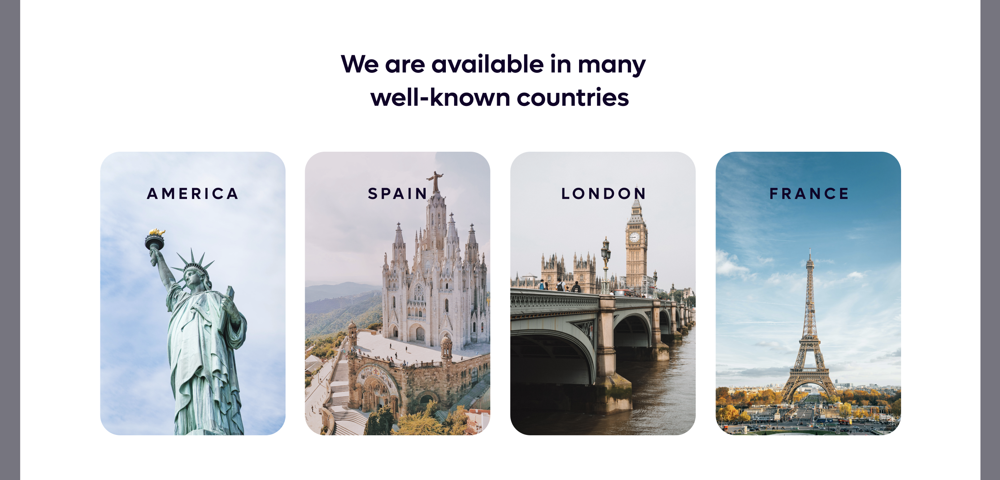
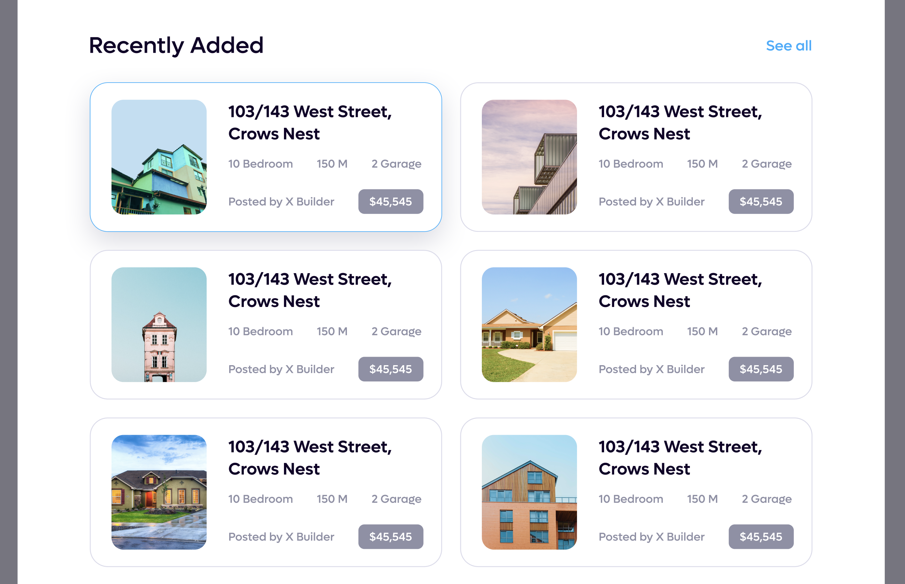
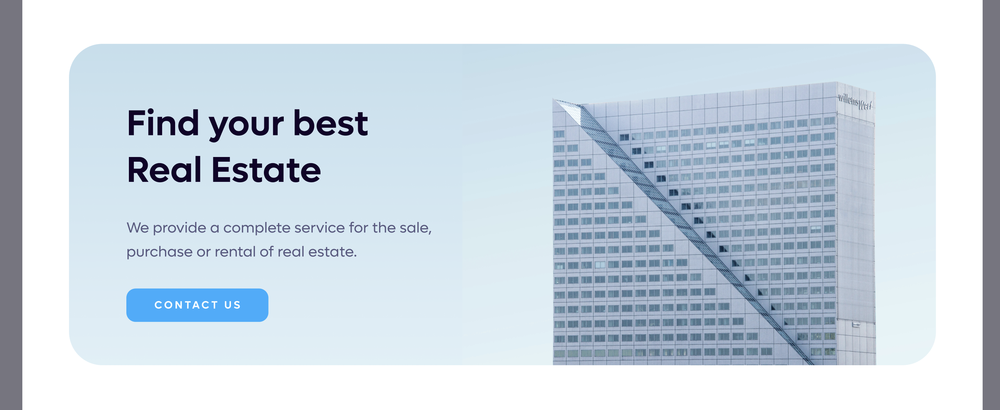
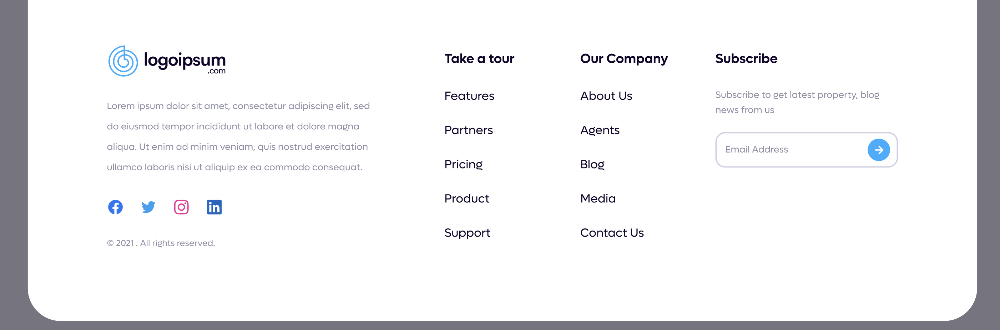

# Real Estate Landing Project

# Subjective

🚀 Welcome to the React Challenge Day-2 🚀
🚀 Build your Real Estate website 🚀

#### 🎯 Objective

- Create Project by Using Create React App
- Breaking Down Problem (Page to Component)
- Write Reuseable Component with Props
- Render List
- CSS Practice
- Peer Learning with Project Based

#### 📝 Task:

- ดู requirement จาก UI-Design ได้ที่ http://tinyurl.com/4ku6rekz
- วิเคราะห์ + แบ่ง UI ออกมาเป็น Component
- สร้าง Project โดย Create React App ตั้งชื่อว่า real-estate-landing-page
- ลบไฟล์ที่ไม่จำเป็นทิ้ง
- ทำ Website ขึ้นมาโดยใช้ Component ให้น้อยที่สุด
- Deploy in Netlify

#### Suggestion 🧘🏻 :

- Don't try to solve Big problem, Break it down

#### 🚧 Challenge :

- Implement Children props
- Write Most Reusable Component

🌈 Enjoy the coding journey, and remember:
"The more you code, the more you learn!" 🚀🌐

# Preview

